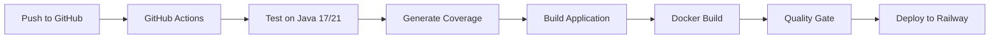

# CI/CD Setup Guide

このプロジェクトでは、GitHub ActionsとDockerを使用したCI/CDパイプラインが設定されています。

## 🚀 CI/CD パイプライン概要

### GitHub Actions ワークフロー

1. **`.github/workflows/ci.yml`** - メインCI/CDパイプライン
   - 複数のJavaバージョン (17, 21) でのテスト実行
   - コードカバレッジレポート生成
   - Dockerイメージビルド
   - SonarCloudによる品質分析

2. **`.github/workflows/test-only.yml`** - テスト専用ワークフロー
   - 手動実行可能
   - 毎日午前2時の定期実行
   - カバレッジレポート付きPRコメント

## 📋 テスト実行方法

### ローカル環境

```bash
# 通常のテスト実行
mvn test

# CI プロファイルでのテスト実行
mvn test -Pci

# カバレッジレポート生成
mvn test jacoco:report

# 統合テスト実行
mvn verify
```

### Docker環境

```bash
# テスト用コンテナでの実行
docker-compose -f docker-compose.test.yml up test-runner

# アプリケーション全体のテスト
docker-compose -f docker-compose.test.yml up
```

## 🔧 CI/CD 設定

### 必要なSecrets (GitHub Settings)

```bash
# Docker Hub (オプション)
DOCKER_USERNAME=your-dockerhub-username
DOCKER_PASSWORD=your-dockerhub-password

# SonarCloud (オプション)
SONAR_TOKEN=your-sonar-token
```

### Maven プロファイル

- **`ci`** - CI環境用設定
  - カバレッジチェック有効
  - テスト失敗時にビルド停止

- **`docker`** - Docker用設定
  - テストスキップ
  - 高速ビルド

## 📊 テスト構成

### テストタイプ

1. **ユニットテスト** (`*Test.java`)
   - ドメインロジックテスト
   - サービス層テスト
   - リポジトリテスト

2. **統合テスト** (`*IntegrationTest.java`)
   - APIエンドポイントテスト
   - データベース連携テスト

3. **カバレッジ目標**
   - 行カバレッジ: 70%
   - ブランチカバレッジ: 60%

### テストレポート

テスト実行後、以下のレポートが生成されます：

- `target/surefire-reports/` - テスト結果
- `target/site/jacoco/` - カバレッジレポート

## 🐳 Docker 構成

### Dockerfile

- **マルチステージビルド**採用
- **Alpine Linux**ベースで軽量化
- **レイヤーキャッシュ**最適化

### Docker Compose

- **`docker-compose.yml`** - 本番用
- **`docker-compose.test.yml`** - テスト用
- **H2データベース**統合

## 🔍 品質ゲート

### 自動チェック項目

1. ✅ 全テストパス
2. ✅ コードカバレッジ基準達成
3. ✅ ビルド成功
4. ✅ Dockerイメージ作成成功

### 手動チェック項目

- [ ] コードレビュー完了
- [ ] セキュリティ脆弱性チェック
- [ ] パフォーマンステスト

## 🚀 デプロイメント

### 自動デプロイ条件

- `main`ブランチへのプッシュ
- 全テストパス
- 品質ゲート通過

### デプロイ先

- **Railway** - 本番環境
- **Docker Hub** - イメージレジストリ

## 📈 監視・ログ

### メトリクス

- テスト実行時間
- カバレッジ推移
- ビルド成功率

### ログ

- GitHub Actions実行ログ
- アプリケーションログ
- テスト実行ログ

## 🔧 トラブルシューティング

### よくある問題

1. **JaCoCoエラー**
   ```bash
   # Java 23でのJaCoCo互換性問題
   mvn test -Djacoco.skip=true
   ```

2. **メモリ不足**
   ```bash
   # Maven実行時のメモリ増加
   export MAVEN_OPTS="-Xmx1024m"
   ```

3. **テストタイムアウト**
   ```bash
   # テストタイムアウト時間延長
   mvn test -Dsurefire.timeout=600
   ```

## 📚 関連ドキュメント

- [GitHub Actions Documentation](https://docs.github.com/en/actions)
- [Docker Documentation](https://docs.docker.com/)
- [Maven Surefire Plugin](https://maven.apache.org/surefire/maven-surefire-plugin/)
- [JaCoCo Documentation](https://www.jacoco.org/jacoco/trunk/doc/)

---

## 🎯 CI/CD パイプライン実行状況



パイプラインの各ステップが正常に完了すると、自動的にアプリケーションがデプロイされます。
